# PKCE認証システム - PLC制御アプリケーション

**PKCE（Proof Key for Code Exchange）認証**を使用したセキュアなPLC制御Webアプリケーションです。AWS Cognitoとの連携により、クライアントシークレット不要の安全な認証フローを実現しています。

## 🎯 主要機能

- ✅ **PKCE認証フロー** - RFC7636準拠の実装
- ✅ **PLC制御API** - 認証済みユーザーのみアクセス可能
- ✅ **AWS Cognito統合** - ユーザー管理とトークン検証
- ✅ **デバッグ機能** - 認証フローの可視化
- ✅ **レスポンシブUI** - モバイル対応
- ✅ **Amplifyホスティング** - シームレスなデプロイ

## 🏗️ アーキテクチャ

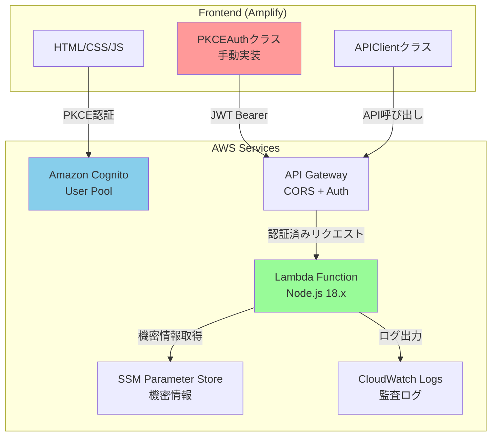

## 💻 技術スタック

| カテゴリ | 技術 |
|----------|------|
| **Infrastructure** | AWS CDK (TypeScript) |
| **Authentication** | Amazon Cognito (PKCE対応) |
| **API** | API Gateway + Lambda |
| **Storage** | SSM Parameter Store |
| **Hosting** | AWS Amplify |
| **Frontend** | HTML5 + CSS3 + JavaScript (ES6+) |

---

## 🔐 PKCE認証実装詳細（pkce-auth.js）

### 📚 PKCEとは

**PKCE（Proof Key for Code Exchange）** は、OAuth 2.0の拡張仕様（RFC7636）で、パブリッククライアント（SPAやモバイルアプリ）でも安全に認証を行える仕組みです。

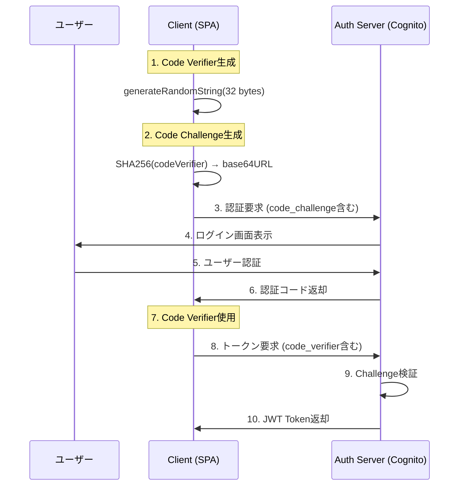

**従来のOAuth 2.0の問題:**
- クライアントシークレットが必要
- ブラウザで秘密情報を保持するリスク
- 中間者攻撃の脆弱性

**PKCEの解決策:**
- 動的に生成されるCode VerifierとCode Challenge
- クライアントシークレット不要
- 中間者攻撃の防止

### 🏗️ PKCEAuthクラス設計

#### 設計思想

```javascript
class PKCEAuth {
    constructor(config) {
        this.config = config;           // 設定情報
        this.codeVerifier = null;       // PKCE Code Verifier
        this.tokens = null;             // 取得したトークン
        this.debugSteps = [];           // デバッグ情報
    }
}
```

**なぜクラス設計にしたか:**
1. **状態管理の一元化** - PKCE関連の状態をまとめて管理
2. **再利用性** - 複数の認証インスタンスに対応
3. **拡張性** - 新しい認証方式の追加が容易
4. **デバッグ機能** - 認証フローの追跡が可能

#### Core PKCE Methods

##### 🔢 Code Verifier生成

```javascript
generateRandomString() {
    const array = new Uint8Array(32);
    crypto.getRandomValues(array);
    return this.base64URLEncode(array);
}
```

**実装のポイント:**
- **32バイトのランダム値** - RFC7636推奨サイズ
- **crypto.getRandomValues()** - 暗号学的に安全な乱数生成
- **十分なエントロピー** - 2^256の組み合わせ

##### 🔐 Code Challenge生成

```javascript
async generateCodeChallenge(codeVerifier) {
    const encoder = new TextEncoder();
    const data = encoder.encode(codeVerifier);
    const digest = await crypto.subtle.digest('SHA-256', data);
    return this.base64URLEncode(digest);
}
```

**実装のポイント:**
- **SHA-256ハッシュ** - PKCE標準アルゴリズム
- **Base64URL エンコード** - URL安全な文字セット
- **非可逆変換** - Code Verifierの逆算不可

##### 🔤 Base64URL エンコード

```javascript
base64URLEncode(buffer) {
    return btoa(String.fromCharCode.apply(null, new Uint8Array(buffer)))
        .replace(/\+/g, '-')    // + → -
        .replace(/\//g, '_')    // / → _
        .replace(/=/g, '');     // パディング削除
}
```

**RFC7636準拠の変換:**
- 標準Base64からBase64URLへの変換
- URLパラメータで安全に使用可能

### 🔄 認証フロー詳細

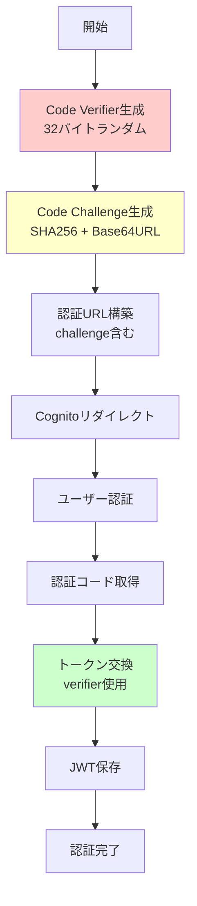

#### 1️⃣ 認証URL生成

```javascript
async getAuthURL() {
    // 1. Code Verifier生成
    this.codeVerifier = this.generateRandomString();
    
    // 2. Code Challenge生成
    const codeChallenge = await this.generateCodeChallenge(this.codeVerifier);
    
    // 3. セッションストレージに保存
    sessionStorage.setItem('pkce_code_verifier', this.codeVerifier);
    
    // 4. OAuth パラメータ構築
    const params = new URLSearchParams({
        response_type: 'code',
        client_id: this.config.clientId,
        redirect_uri: this.config.redirectUri,
        code_challenge: codeChallenge,
        code_challenge_method: 'S256',
        scope: 'openid profile email'
    });
    
    return `${this.config.cognitoDomain}/oauth2/authorize?${params}`;
}
```

**フロー図:**
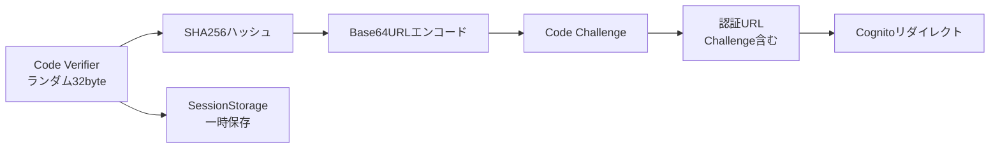

#### 2️⃣ トークン交換

```javascript
async getTokens(authCode) {
    // 1. Code Verifier取得
    const codeVerifier = sessionStorage.getItem('pkce_code_verifier');
    if (!codeVerifier) {
        throw new Error('Code verifier not found');
    }
    
    // 2. トークンリクエスト
    const params = new URLSearchParams({
        grant_type: 'authorization_code',
        client_id: this.config.clientId,
        code: authCode,
        redirect_uri: this.config.redirectUri,
        code_verifier: codeVerifier  // 重要: Code Verifierで検証
    });
    
    const response = await fetch(`${this.config.cognitoDomain}/oauth2/token`, {
        method: 'POST',
        headers: { 'Content-Type': 'application/x-www-form-urlencoded' },
        body: params
    });
    
    // 3. トークン保存
    const tokens = await response.json();
    localStorage.setItem('id_token', tokens.id_token);
    localStorage.setItem('access_token', tokens.access_token);
    
    return tokens;
}
```

**セキュリティポイント:**
- Code VerifierでCode Challengeを検証
- セッションストレージで一時保存（タブ閉じると削除）
- ローカルストレージでトークン永続化

### 🛡️ セキュリティ考慮事項

#### 1. Code Verifierの安全性

```javascript
// ❌ 脆弱な実装例
Math.random().toString(36); // 予測可能

// ✅ 安全な実装
crypto.getRandomValues(new Uint8Array(32)); // 暗号学的乱数
```

#### 2. ストレージの使い分け

| データ | ストレージ | 理由 | 有効期限 |
|--------|------------|------|----------|
| Code Verifier | SessionStorage | 一時的、タブ限定 | タブ閉じまで |
| Access Token | LocalStorage | 永続化、自動ログイン | 1時間 |
| Refresh Token | LocalStorage | 長期利用 | 30日 |
| ID Token | LocalStorage | ユーザー情報取得 | 1時間 |

#### 3. XSS対策

```html
<!-- Content Security Policy推奨 -->
<meta http-equiv="Content-Security-Policy" 
      content="default-src 'self'; script-src 'self' 'unsafe-inline'">
```

### 🐛 デバッグ機能

#### デバッグステップ追跡

```javascript
addDebugStep(step, details) {
    this.debugSteps.push({
        timestamp: new Date().toISOString(),
        step,
        details
    });
}
```

**デバッグUI機能:**

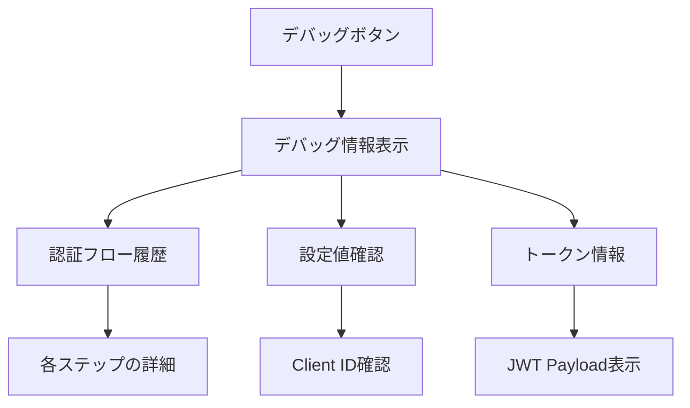

#### よくあるエラーと解決法

| エラー | 原因 | 解決法 | 確認ポイント |
|--------|------|--------|--------------|
| `redirect_mismatch` | コールバックURL不一致 | Cognitoで許可URL設定 | 設定値とAmplify URLの一致 |
| `invalid_grant` | Code Verifier不正 | セッションストレージ確認 | Code Verifierの生成と保存 |
| `unauthorized_client` | Client ID不正 | 設定値確認 | CDK出力値との一致 |
| `invalid_request` | パラメータ不正 | リクエスト内容確認 | OAuth パラメータの妥当性 |

---

## 📱 JWT Bearer認証とAPI呼び出し詳細

### 🎯 アクセストークンからAPI呼び出しまでの完全フロー

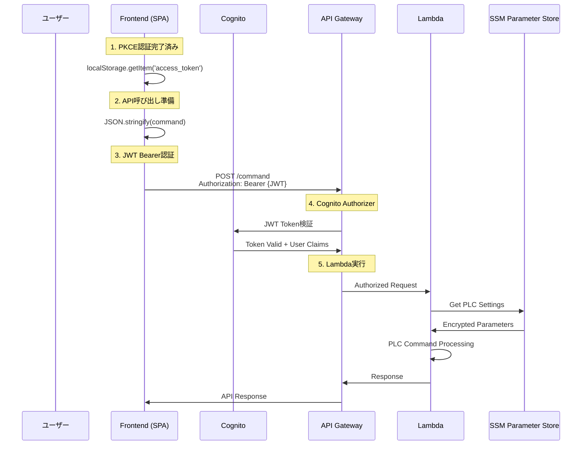

### 🔐 JWTアクセストークンの詳細

#### トークンの構造と内容

PKCEフローで取得されるアクセストークンは **JWT（JSON Web Token）** 形式です：

```javascript
// JWT構造 (Base64URLエンコード)
{
  "header": {
    "alg": "RS256",
    "kid": "cognito-key-id"
  },
  "payload": {
    "sub": "user-uuid",
    "aud": "XXXXXXXXXXXXXXXXXXXXXXXXXX",  // Client ID
    "iss": "https://cognito-idp.ap-northeast-1.amazonaws.com/ap-northeast-1_XXXXXXXXX",
    "exp": 1704067200,  // 有効期限（通常1時間）
    "iat": 1704063600,  // 発行時刻
    "scope": "openid profile email",
    "token_use": "access"
  },
  "signature": "..."
}
```

#### トークンの検証プロセス

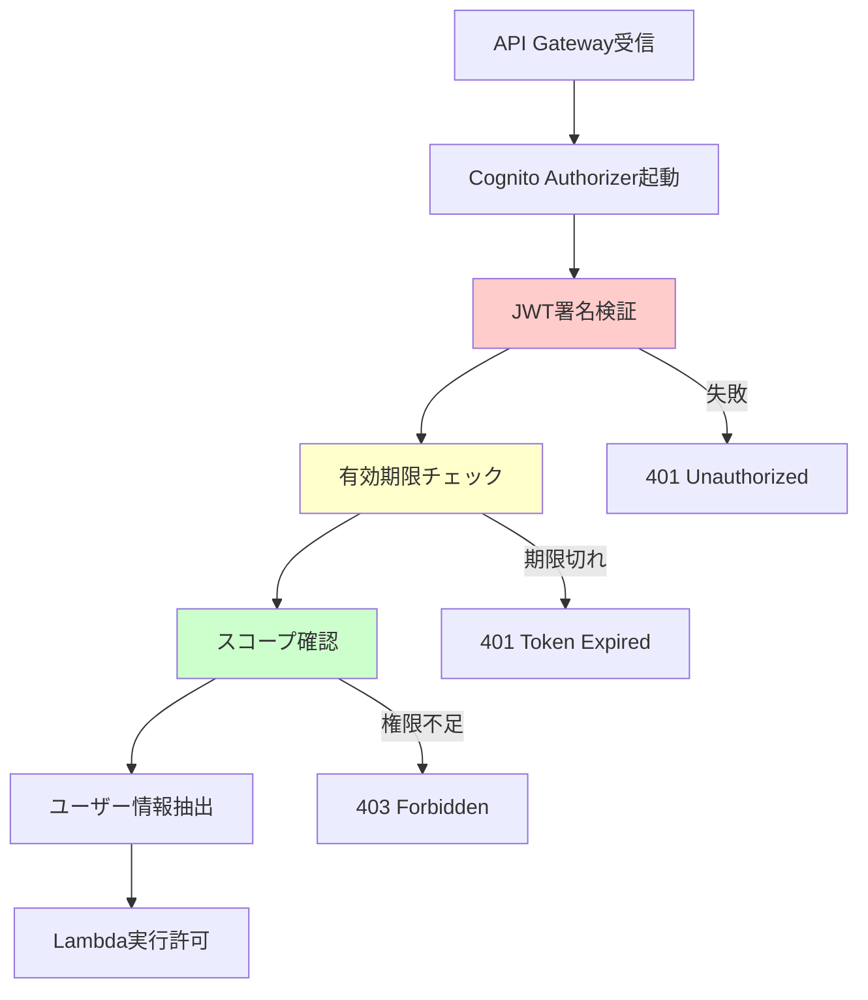

### 🏗️ APIClientクラス詳細設計

#### 完全な実装とエラーハンドリング

```javascript
class APIClient {
    constructor(apiEndpoint) {
        this.apiEndpoint = apiEndpoint;
        this.maxRetries = 3;
        this.retryDelay = 1000; // 1秒
    }

    /**
     * PLCコマンド送信（リトライ機能付き）
     * @param {Object} command - PLCコマンドオブジェクト
     * @returns {Promise<Object>} API レスポンス
     */
    async sendCommand(command) {
        for (let attempt = 1; attempt <= this.maxRetries; attempt++) {
            try {
                return await this._sendCommandAttempt(command);
            } catch (error) {
                if (error.status === 401 && attempt === 1) {
                    // トークン期限切れの可能性 - リフレッシュ試行
                    await this._attemptTokenRefresh();
                    continue;
                }
                
                if (attempt === this.maxRetries) {
                    throw error; // 最後の試行でも失敗
                }
                
                // 一時的エラーの場合はリトライ
                if (this._isRetryableError(error)) {
                    await this._delay(this.retryDelay * attempt);
                    continue;
                }
                
                throw error; // リトライ不可能なエラー
            }
        }
    }

    /**
     * 実際のAPI呼び出し処理
     */
    async _sendCommandAttempt(command) {
        // 1. アクセストークン取得と検証
        const accessToken = this._getValidAccessToken();
        
        // 2. リクエストヘッダー構築
        const headers = this._buildHeaders(accessToken);
        
        // 3. リクエストボディ構築
        const body = this._buildRequestBody(command);
        
        // 4. API呼び出し実行
        const response = await fetch(`${this.apiEndpoint}/command`, {
            method: 'POST',
            headers,
            body
        });

        // 5. レスポンス処理
        return await this._handleResponse(response);
    }

    /**
     * アクセストークンの取得と基本検証
     */
    _getValidAccessToken() {
        const accessToken = localStorage.getItem('access_token');
        
        if (!accessToken) {
            throw new APIError('認証が必要です。ログインしてください。', 'NO_TOKEN', 401);
        }

        // JWT の基本構造確認（3つの部分がドットで区切られている）
        if (!this._isValidJWTFormat(accessToken)) {
            throw new APIError('無効なトークン形式です。', 'INVALID_TOKEN_FORMAT', 401);
        }

        // 有効期限の事前チェック（簡易版）
        if (this._isTokenExpiredLocally(accessToken)) {
            throw new APIError('トークンが期限切れです。', 'TOKEN_EXPIRED', 401);
        }

        return accessToken;
    }

    /**
     * HTTPヘッダー構築
     */
    _buildHeaders(accessToken) {
        return {
            'Content-Type': 'application/json',
            'Authorization': `Bearer ${accessToken}`,
            'X-Requested-With': 'XMLHttpRequest', // CSRF対策
            'Accept': 'application/json'
        };
    }

    /**
     * リクエストボディ構築と検証
     */
    _buildRequestBody(command) {
        // コマンド形式の検証
        if (!this._isValidCommand(command)) {
            throw new APIError('無効なコマンド形式です。', 'INVALID_COMMAND', 400);
        }

        // セキュリティ: 危険なコマンドのフィルタリング
        this._sanitizeCommand(command);

        return JSON.stringify({
            ...command,
            timestamp: new Date().toISOString(),
            clientVersion: '1.0.0'
        });
    }

    /**
     * レスポンス処理と詳細エラーハンドリング
     */
    async _handleResponse(response) {
        const contentType = response.headers.get('content-type');
        
        // Content-Type確認
        if (!contentType || !contentType.includes('application/json')) {
            throw new APIError('予期しないレスポンス形式です。', 'INVALID_RESPONSE_TYPE', response.status);
        }

        let responseData;
        try {
            responseData = await response.json();
        } catch (parseError) {
            throw new APIError('レスポンスの解析に失敗しました。', 'RESPONSE_PARSE_ERROR', response.status);
        }

        // ステータスコード別の詳細処理
        if (!response.ok) {
            return this._handleErrorResponse(response.status, responseData);
        }

        // 成功レスポンスの検証
        if (!this._isValidSuccessResponse(responseData)) {
            throw new APIError('無効な成功レスポンスです。', 'INVALID_SUCCESS_RESPONSE', 200);
        }

        return responseData;
    }

    /**
     * 詳細なエラーレスポンス処理
     */
    _handleErrorResponse(status, responseData) {
        const errorMap = {
            400: () => new APIError(
                responseData.message || 'リクエストが無効です。', 
                'BAD_REQUEST', 
                400
            ),
            401: () => new APIError(
                '認証に失敗しました。再ログインしてください。', 
                'UNAUTHORIZED', 
                401
            ),
            403: () => new APIError(
                'このコマンドを実行する権限がありません。', 
                'FORBIDDEN', 
                403
            ),
            429: () => new APIError(
                'リクエストが多すぎます。しばらく待ってから再試行してください。', 
                'RATE_LIMIT_EXCEEDED', 
                429
            ),
            500: () => new APIError(
                'サーバー内部エラーが発生しました。', 
                'INTERNAL_SERVER_ERROR', 
                500
            )
        };

        const createError = errorMap[status] || (() => new APIError(
            `予期しないエラーです。(HTTP ${status})`,
            'UNKNOWN_ERROR',
            status
        ));

        throw createError();
    }

    /**
     * JWT形式の基本検証
     */
    _isValidJWTFormat(token) {
        return typeof token === 'string' && token.split('.').length === 3;
    }

    /**
     * トークン有効期限の事前チェック（ローカル）
     */
    _isTokenExpiredLocally(token) {
        try {
            const payload = JSON.parse(atob(token.split('.')[1]));
            const currentTime = Math.floor(Date.now() / 1000);
            const expirationTime = payload.exp;
            
            // 5分のバッファを設けて期限切れ判定
            return currentTime >= (expirationTime - 300);
        } catch (error) {
            // パース失敗時は期限切れとして扱う
            return true;
        }
    }

    /**
     * コマンド形式の検証
     */
    _isValidCommand(command) {
        return command && 
               typeof command === 'object' &&
               typeof command.command === 'string' &&
               typeof command.area === 'string' &&
               typeof command.address === 'string';
    }

    /**
     * コマンドのサニタイゼーション
     */
    _sanitizeCommand(command) {
        // SQLインジェクション対策
        const dangerousPatterns = [';', '--', '/*', '*/', 'xp_', 'sp_'];
        
        Object.keys(command).forEach(key => {
            if (typeof command[key] === 'string') {
                dangerousPatterns.forEach(pattern => {
                    if (command[key].toLowerCase().includes(pattern)) {
                        throw new APIError('危険なコマンドが検出されました。', 'DANGEROUS_COMMAND', 400);
                    }
                });
            }
        });
    }

    /**
     * 成功レスポンスの検証
     */
    _isValidSuccessResponse(response) {
        return response && 
               typeof response === 'object' &&
               'success' in response;
    }

    /**
     * トークンリフレッシュ試行
     */
    async _attemptTokenRefresh() {
        const refreshToken = localStorage.getItem('refresh_token');
        if (!refreshToken) {
            throw new APIError('リフレッシュトークンがありません。再ログインしてください。', 'NO_REFRESH_TOKEN', 401);
        }

        // PKCEAuthインスタンスを使用してトークンリフレッシュ
        try {
            // 注意: 実際の実装では、PKCEAuthインスタンスへの参照が必要
            console.log('トークンリフレッシュを試行しています...');
            // await this.authInstance.refreshTokens();
        } catch (error) {
            throw new APIError('トークンのリフレッシュに失敗しました。', 'REFRESH_FAILED', 401);
        }
    }

    /**
     * リトライ可能エラーの判定
     */
    _isRetryableError(error) {
        const retryableStatuses = [408, 429, 500, 502, 503, 504];
        return retryableStatuses.includes(error.status);
    }

    /**
     * 遅延処理
     */
    _delay(ms) {
        return new Promise(resolve => setTimeout(resolve, ms));
    }
}

/**
 * カスタムAPIエラークラス
 */
class APIError extends Error {
    constructor(message, code, status) {
        super(message);
        this.name = 'APIError';
        this.code = code;
        this.status = status;
    }
}
```

### 🔄 API Gateway Cognito Authorizerの詳細

#### 認証フロー

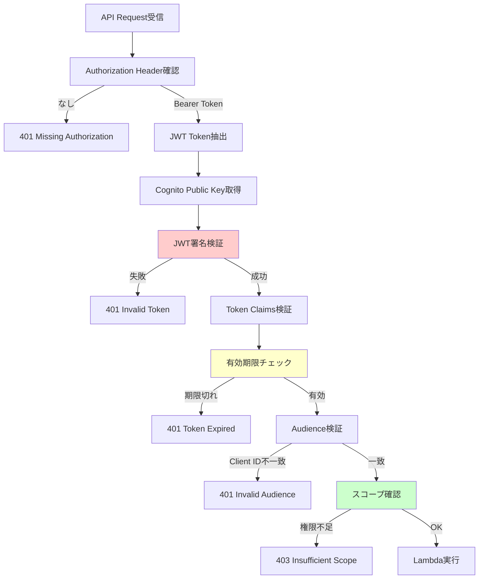

#### Lambda関数での認証情報利用

```javascript
// Lambda関数内でのユーザー情報取得
exports.handler = async (event) => {
    // API Gateway Authorizerから提供される認証情報
    const requestContext = event.requestContext;
    const authorizer = requestContext.authorizer;
    
    // Cognitoから提供されるユーザー情報
    const userId = authorizer.claims.sub;           // ユーザーID
    const email = authorizer.claims.email;          // メールアドレス
    const clientId = authorizer.claims.aud;         // Client ID
    const scopes = authorizer.claims.scope.split(' '); // 許可スコープ
    
    // 監査ログ記録
    console.log(`API Called by user: ${email} (${userId})`);
    
    // コマンド処理
    const command = JSON.parse(event.body);
    
    // セキュリティ: ユーザー固有の制限チェック
    if (!isUserAuthorizedForCommand(userId, command)) {
        return {
            statusCode: 403,
            body: JSON.stringify({
                success: false,
                error: 'Command not authorized for this user'
            })
        };
    }
    
    // PLC制御実行
    const result = await executePLCCommand(command, userId);
    
    return {
        statusCode: 200,
        headers: {
            'Content-Type': 'application/json',
            'Access-Control-Allow-Origin': '*'
        },
        body: JSON.stringify({
            success: true,
            data: result,
            executedBy: email,
            timestamp: new Date().toISOString()
        })
    };
};
```

### 🛡️ セキュリティ考慮事項

#### 1. トークンの安全な管理

```javascript
// ベストプラクティス
class SecureTokenManager {
    static getAccessToken() {
        const token = localStorage.getItem('access_token');
        
        // XSS対策: トークンの基本検証
        if (!token || !this.isValidJWTStructure(token)) {
            throw new Error('Invalid or missing token');
        }
        
        return token;
    }
    
    static setTokens(tokens) {
        // HttpOnly Cookieが理想だが、SPAでは制限があるためlocalStorageを使用
        // 注意: 本番環境では追加のセキュリティ対策を検討
        localStorage.setItem('access_token', tokens.access_token);
        if (tokens.refresh_token) {
            localStorage.setItem('refresh_token', tokens.refresh_token);
        }
    }
    
    static clearTokens() {
        localStorage.removeItem('access_token');
        localStorage.removeItem('refresh_token');
        localStorage.removeItem('id_token');
    }
}
```

#### 2. API呼び出しのセキュリティ

| 項目 | 実装内容 | 目的 |
|------|----------|------|
| **HTTPS強制** | `fetch()` でHTTPS URLのみ | 通信の暗号化 |
| **CORS設定** | API Gateway CORS設定 | クロスオリジン制御 |
| **Content-Type検証** | `application/json` のみ許可 | インジェクション防止 |
| **レート制限** | API Gateway スロットリング | DoS攻撃防止 |
| **入力検証** | コマンド形式とパラメータ検証 | インジェクション防止 |

### 📊 API呼び出しのモニタリング

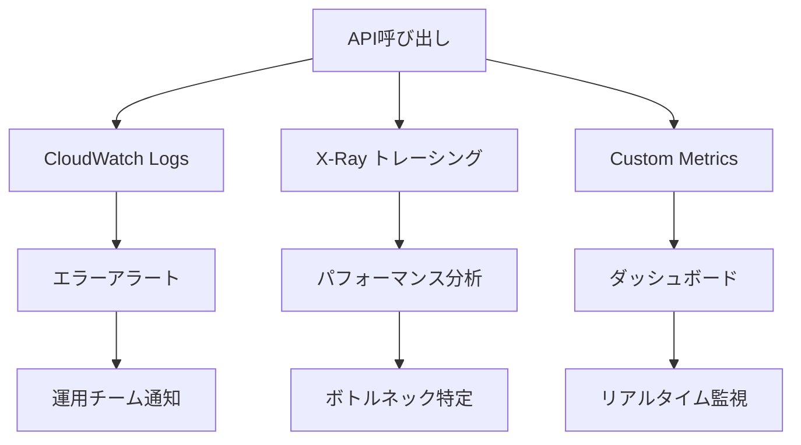

このように、PKCEで取得したJWTアクセストークンを使用してAPI Gatewayにセキュアにアクセスし、Lambdaでの処理まで含めた完全なフローを実装しています。

---

## 🚀 セットアップ手順

### 前提条件

```bash
# 必要なツール
node --version    # v18以上
npm --version     # v9以上
aws --version     # AWS CLI v2
cdk --version     # AWS CDK v2
```

### 1. CDKスタックのデプロイ

```bash
# 依存関係インストール
npm install

# CDKビルド
npm run build

# AWSにデプロイ
npx cdk deploy --require-approval never
```

**出力される重要な値:**
- User Pool ID: `ap-northeast-1_XXXXXXXXX`
- App Client ID: `XXXXXXXXXXXXXXXXXXXXXXXXXX`
- Cognito Domain: `https://pkce-auth-XXXXXXXXXXXX.auth.ap-northeast-1.amazoncognito.com`
- API Endpoint: `https://XXXXXXXXXX.execute-api.ap-northeast-1.amazonaws.com/prod/`

### 2. フロントエンドの設定

`frontend/pkce-auth.js`の設定値を更新:

```javascript
const config = {
    clientId: 'XXXXXXXXXXXXXXXXXXXXXXXXXX',
    cognitoDomain: 'https://pkce-auth-XXXXXXXXXXXX.auth.ap-northeast-1.amazoncognito.com',
    redirectUri: window.location.origin + '/callback',
    logoutUri: window.location.origin,
    apiEndpoint: 'https://XXXXXXXXXX.execute-api.ap-northeast-1.amazonaws.com/prod/'
};
```

### 3. Amplifyデプロイ

1. **AWS Amplify Console**にアクセス
2. **「新しいアプリをホスト」**を選択
3. **手動デプロイ**でファイルをアップロード
4. `amplify.yml`が自動認識される

### 4. Cognitoコールバック設定更新

AmplifyのURLを取得後、CDKスタックを更新:

```typescript
callbackUrls: [
  'https://staging.XXXXXXXXX.amplifyapp.com/callback',  // AmplifyのURL
  'http://localhost:3000/callback',
],
```

---

## 🔧 設定ファイル詳細

### amplify.yml

```yaml
version: 1
frontend:
  phases:
    preBuild:
      commands:
        - echo "フロントエンドファイルを準備中..."
    build:
      commands:
        - cp -r frontend/* .
  artifacts:
    baseDirectory: .
    files:
      - '**/*'
```

### CDKスタック構成

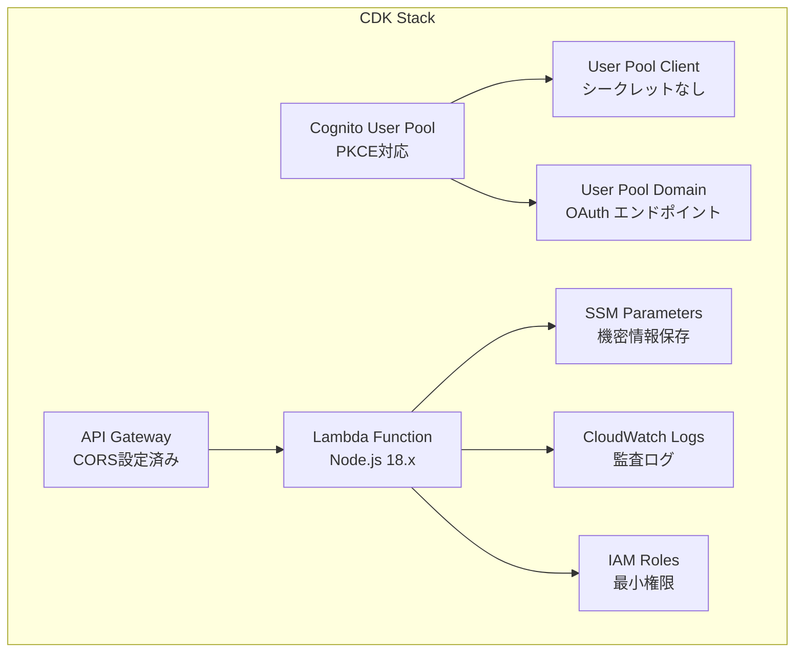

---

## 💡 Amplify Gen2との比較

### 現在の手動実装 vs Amplify Gen2

| 項目 | 手動実装 | Amplify Gen2 |
|------|----------|--------------|
| **コード量** | ~400行 | ~20行 |
| **設定管理** | 手動 | 自動 |
| **型安全性** | なし | TypeScript完全対応 |
| **メンテナンス** | 手動更新 | SDK自動更新 |
| **学習価値** | 高い | 低い |
| **カスタマイズ** | 自由度高 | 制限あり |

### Amplify Gen2での実装例

```typescript
// わずか数行でPKCE認証
import { signIn, signOut, getCurrentUser } from 'aws-amplify/auth';

// ログイン
await signIn();

// 現在のユーザー取得
const user = await getCurrentUser();

// API呼び出し（自動認証）
const result = await client.graphql({
  query: myQuery,
  // 認証ヘッダー自動付与
});
```

### 学習価値

**手動実装のメリット:**
- PKCEの仕組みを深く理解
- OAuth 2.0の詳細な動作を把握
- セキュリティ要件の実装経験
- カスタマイズの自由度

**Amplify Gen2のメリット:**
- 開発速度の向上
- ベストプラクティスの自動適用
- メンテナンスコストの削減
- エコシステムとの統合

---

## 🐛 トラブルシューティング

### PKCE関連エラー

#### `invalid_request` - パラメータ不正

```javascript
// デバッグ方法
console.log('Code Challenge:', codeChallenge);
console.log('Code Verifier:', codeVerifier);

// 確認ポイント
- Code ChallengeがBase64URLか
- Code Verifierが43-128文字か
- code_challenge_methodがS256か
```

#### `invalid_grant` - Code Verifier不一致

```javascript
// 原因
1. セッションストレージからの取得失敗
2. 異なるタブでの認証継続
3. Code Verifierの文字化け

// 解決法
sessionStorage.clear(); // セッションクリア
location.reload();      // ページ再読み込み
```

### Cognitoエラー

#### `redirect_mismatch`

```bash
# CDKでコールバックURL追加
callbackUrls: [
  'https://your-domain.com/callback'
]

# 再デプロイ
npx cdk deploy
```

### デバッグ方法

```javascript
// デバッグ情報表示
const auth = new PKCEAuth(config);
console.log('Debug Steps:', auth.debugSteps);

// ネットワーク確認
// Chrome DevTools > Network > XHR
// Cognitoへのリクエスト/レスポンス確認
```

---

## 📁 プロジェクト構造

```
pkce-auth-cdk/
├── 📁 bin/                    # CDK エントリーポイント
├── 📁 lib/                    # CDK スタック定義
│   └── pkce-auth-cdk-stack.ts
├── 📁 lambda/                 # Lambda 関数
│   └── api-handler.ts
├── 📁 frontend/               # フロントエンド
│   ├── index.html
│   ├── callback.html
│   ├── pkce-auth.js          # 🔥 PKCE実装コア
│   └── styles.css
├── amplify.yml               # Amplify ビルド設定
├── package.json
└── README.md
```

---

## 🚀 今後の拡張案

### 1. セキュリティ強化

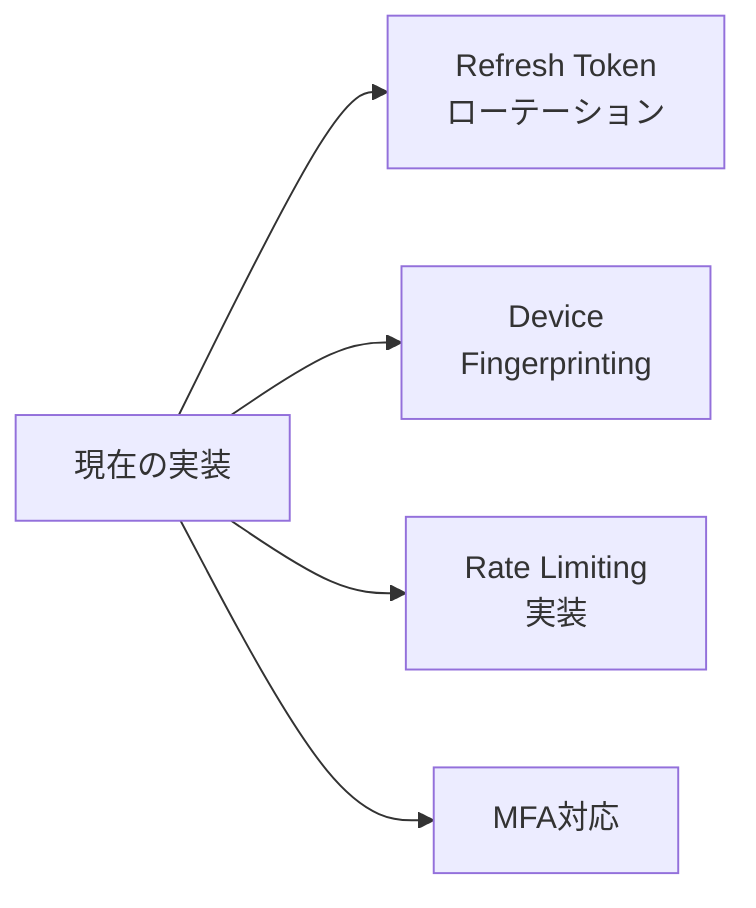

### 2. UX改善

- **Progressive Web App対応**
- **オフライン機能**
- **プッシュ通知**

### 3. 監視・ログ

- **CloudWatch Dashboards**
- **X-Ray トレーシング**
- **カスタムメトリクス**
